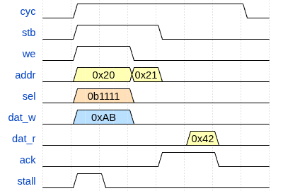

# Building USoC Part 1: The Wishbone Bus

A few weeks ago, I started researching and outlining a book called *The Whole
Machine*. The goal is to teach teenagers - specifically my son, when he gets a
bit older - how to build a computer entirely from scratch.

I don't mean "understand the concepts." True understanding only comes from
building, which means the goal of the book is to write every single line of code
and hardware description from scratch. No massive third-party libraries, no
closed-source IP blocks, no hand-waving.

To make it possible for a teenager to actually build a complete machine from the
ground up, you have to radically simplify everything. You have to aggressively
slice away the historical cruft and unnecessary complexity that plages modern
commercial architectures. But a funny thing happened during those first two
weeks of conceptual design: I looked at the blueprint and realized it wasn't
just an educational toy. By forcing myself to strip the architecture down to a
level where every single line could be built from scratch, I had accidentally
designed what I believe is the future of embedded computing.

I immediately shifted gears. Under the moniker AxiomFactory, I am turning that
blueprint into a next-generation, WebAssembly-based IoT platform.

While my day job is in software engineering, I am no stranger to formal methods,
having verified a small RISC-V core and used Idris to prove distributed Rust
algorithms correct about five years ago. Over the last two weeks, I sat down to
build and formally verify the first major component of this new SoC: an internal,
arbitration-free Wishbone bus fabric.

By leaning on dual-port SRAM and structural simplicity, the design reaches an
Fmax of 180MHz on ECP5 and 93MHz on iCE40 - some of the cheapest, most accessible
FPGAs on the market. Here is how it works, and how I used Amaranth HDL to formally
prove its correctness.

## High level design

Our architecture relies on structural simplicity to keep things moving efficiently.
To be clear: writing a standard Wishbone bus arbiter is actually quite simple.
In fact, I wrote one over the last two weeks just as an exercise. But when looking
at the core goals of this SoC, I realized we could bypass traditional bus
arbitration entirely.

By utilizing a single UBUS controller and a single RISC-V core as our two Wishbone
bus masters, we can build a completely arbitration-free Wishbone bus fabric
simply by routing traffic through dual-port SRAM. This post dives deep into this
"blue" Wishbone fabric.


The heart of the SoC is the UBUS, which acts as a specialized DMA (Direct Memory
Access) controller. Like a standard DMA, it exposes a set of status and control
registers as a Wishbone slave, while using a Wishbone master interface to copy
packets directly from D-SRAM to peripheral FIFOs.

By enforcing a strict, unified set of simple peripheral protocols, we can
implement a single UBUS driver in kernel space to manage packet queues. This
allows us to push the individual peripheral drivers up into WASM user space.

## The Standard Wishbone Interface

Before diving into verification, let's establish the bus protocol baseline. Every
System on Chip requires an on-chip interconnect to link its various components
together. While options like Avalon or AXI are common, we chose Wishbone because
it is exceptionally simple, lightweight, and widely adopted in the open-source
SoC community.

In this project, we use *Amaranth HDL*, a modern, Python-based hardware description
language. A standard Wishbone master interface looks like this in Amaranth:

```python
{
  "cyc":   Out(1),
  "stb":   Out(1),
  "we":    Out(1),
  "addr":  Out(addr_width),
  "sel":   Out(data_width // 8),
  "dat_w": Out(data_width),
  "dat_r": In(data_width),
  "ack":   In(1),
  "stall": In(1),
  "err":   Out(1),
}
```

For a 32-bit bus, the `data_width` is `32` and the `addr_width` is typically `30`
because data is accessed in whole 4-byte words. (In 64-bit designs, the address
width is often artificially capped at a lower value to save routing resources).

### How Data Moves on the Bus

When the CPU executes a load instruction (like `lb`, `lh`, `lw`) from I-RAM it,
it drives the target address onto `addr` and expects data back on `dat_r`. Even
though the bus always returns a full 32-bit word, the CPU automatically masks
out and discards the bytes it doesn't need for smaller byte or half-word
instructions.

For store instructions, the master sets the `we` (write-enable) signal high. It
uses the `sel` (byte-select) lines to tell the slave exactly which bytes in the
word it wants to overwrite.

If a slave is busy and cannot immediately accept a request, it holds the `stall`
line high. Once the slave successfully processes a transaction, it drives the
`ack` (acknowledge) signal. The master initiates a transaction cycle by asserting
`cyc`, and uses `stb` to indicate that a valid data transfer is actively being
requested on the current clock cycle.

The classic Wishbone specification also includes an `err` line, which a bus
decoder uses to signal a fault if an address is invalid. We removed this signal
from our peripherals. Instead, invalid address faults are wired directly from
our decoder to the RISC-V `mstatus` and `mcause` registers. This keeps our
peripherals simpler and saves us from forcing every slave to dedicate a flip-flop
just to drive `err` low.

The diagram below illustrates a typical pipelined transaction: a Whishbone
write immediately followed by a read within the same cycle envelope.



1. **Transaction Start:** The master starts the transaction by asserting `cyc`
along with the write parameters (`stb`, `we`, `addr`, `sel`, `dat_w`).

2. **The Stall:** The slave asserts `stall` immediately, forcing the master to
hold its signals steady.

3. **Write Accepted:** On the next clock edge, the slave drops `stall`, accepting
the write phase.

4. **Pipelined Read:** The master immediately transitions into a read cycle by
changing `addr` and dropping `we` while keeping `stb` high.

5. **Delayed Acknowledge:** Because this slave takes two cycles to process reads
and writes internally, the write completion `ack` appears a cycle late, followed
immediately by the read's `ack` and valid data on `dat_r`.

6. **Transaction Complete:** Finally, the master terminates the transaction by
dropping `cyc`.

To summarize this behaviour mathematically:

- A transaction phase begins when: `cyc & stb & ~stall`
- A transaction phase completes when: `cyc & ack`

### Formally Verifying the Interconnect

Now that we understand how data moves, we can establish the formal properties
required to prove our Wishbone masters and slaves behave correctly.

The core rule of formal verification is simple: **outputs are asserted, inputs
are assumed.** Because of this, the formal properties of a master and a slave
are exact mirror images. Every rule the master must *assert* as an invariant
is *assumed* by the slave, and vice versa.

### Rule 1: Power-On Reset Invariant

This rule ensures the bus starts in a clean, inactive state immediately after
reset. No transaction should be active (`cyc` and `stb` must be false), and we
assume the slave is not issuing a response.

```python
initial = Signal(init=1)
m.d.sync += initial.eq(0)

with m.If(initial):
    m.d.comb += [
        Assert(~self.cyc),
        Assert(~self.stb),
        Assume(~self.ack),
        Assume(~self.stall),
    ]
```

### Rule 2: Transaction Envelope

The strobe signal (`stb`) must never float high out of nowhere; it can only
be asserted inside an active transaction window.

```python
with m.If(self.stb):
    m.d.comb += Assert(self.cyc)
```

### Rule 3: Pipelined Stability Property

If the master attempts a transfer and the slave stalls, the master cannot change
its mind or alter the payload. It must hold `stb`, `addr`, `we`, `dat_w` and `sel`
prefectly stable until the stall clears or abort the transaction.

```python
past_cyc   = Signal()
past_stb   = Signal()
past_stall = Signal()
past_addr  = Signal(len(self.addr))
past_we    = Signal()
past_dat_w = Signal(len(self.dat_w))
past_sel   = Signal(len(self.sel))

m.d.sync += [
    past_cyc.eq(self.cyc),
    past_stb.eq(self.stb),
    past_stall.eq(self.stall),
    past_addr.eq(self.addr),
    past_we.eq(self.we),
    past_dat_w.eq(self.dat_w),
    past_sel.eq(self.sel)
]

with m.If(past_stb & past_stall & ~initial):
    m.d.comb += [
        Assert(self.stb),
        Assert(self.addr  == past_addr),
        Assert(self.we    == past_we),
        Assert(self.dat_w == past_dat_w),
        Assert(self.sel   == past_sel),
    ]
```

### Rule 4: Anti-Spurious Response

A slave must never issue an acknowledgment if there are no outstanding requests
on the bus. We keep track of in-flight requests using a simple counter.

```python
outstanding = Signal(8)
req_issued = self.cyc & self.stb & ~self.stall
res_rcvd   = self.cyc & self.ack

with m.If(~self.cyc):
    m.d.sync += outstanding.eq(0)
with m.Else():
    m.d.sync += outstanding.eq(outstanding + req_issued - res_rcvd)

with m.If(outstanding == 0):
    m.d.comb += Assume(~self.ack)
```

### Avoiding Formal Pitfalls

Formal verification is full of subtle traps. One major pitfall is **under-constraining
the model**, where the solver passes your assertions simply because inputs are
left floating or dead. When verifying our master we must allow the slave inputs
to take any valid sequence of values to truly stress-test the design:

```python
m.d.comb += [
    self.ack.eq(AnySeq(1)),
    self.stall.eq(AnySeq(1)),
    self.dat_r.eq(AnySeq(32)),
]
```

Another pitfall is trying to prove liveness (that something *eventually* happens).
Liveness properties can be incredibly difficult or impossible to resolve cleanly
in bounded model checking. Instead, we convert liveness into a bounded safety
property: we verify that the slave responds within a strict timeout window.

### Rule 5: Bounded Response Timeout

```python
timeout_count = Signal(2)
with m.If(~self.cyc | self.ack | (~self.stall & self.stb)):
    m.d.sync += timeout_count.eq(0)
with m.Else():
    with m.If(outstanding > 0):
        m.d.sync += timeout_count.eq(timeout_count + 1)
m.d.comb += Assume(timeout_count < 2)
```

### Rule 6: Bounded Request Timeout

```python
with m.If(~self.stb & outstanding == 0):
    m.d.comb += Assert(~self.cyc)
```

The final major pitfall is **vacuity** - a state where your assertions pass
simply because the logic path is never actually triggered by the solver. To
prove our logic isn't just passing vacuously, we use a coverage statement to
force the engine to prove that full pipelined transactions can actually occur
under our rules.

### Rule 7: Pipelined Transaction Coverage
```python
m.d.comb += Cover(self.cyc & self.stb & self.ack)
```

Following the verification of a single Wishbone interface, the next phase
involves connecting components to build a complete System on Chip. Part 2 will
detail the assembly of these blocks, focusing on using a central decoder and
dual-port memory to achieve high \(F_{max}\) on low-cost FPGAs.
